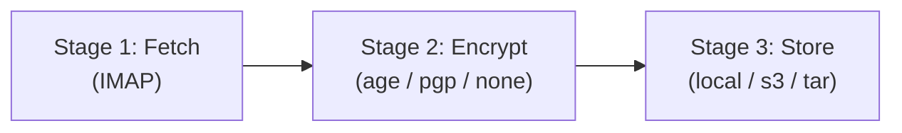

# Stages

A backup run is three stages:

| Stage | What it does | Options |
|---|---|---|
| [1 — Fetch](fetch.md) | Downloads mail from an IMAP server | IMAP |
| [2 — Encrypt](encrypt.md) | Optionally encrypts the downloaded mail | age, OpenPGP, or none |
| [3 — Store](store.md) | Writes the result somewhere | local directory, S3, tar |

Each downloaded message is saved as its own file (`.eml`), plus one file per
extracted attachment when `--attachments` is set. Mail is streamed straight
through encryption into storage as it's downloaded, so even a very large
mailbox never has to fit in memory all at once, and a backup destination is
always safely finalized, even if the run fails partway through.



## Config file layout

Every stage reads its settings from the matching top-level block of the config
file, and every setting can also be given as a CLI flag or an environment
variable — see [Config resolution](#config-resolution) below.

```yaml
version: 1

login:      # Stage 1
  imap: {}

encrypt: {} # Stage 2, optional

save:       # Stage 3
  local: {}
  s3: {}
  tar: {}
```

See `example.yaml` in the repository root for a fully annotated reference of
every key, and [config.schema.json](https://github.com/Cyb3r-Jak3/email-backup-tool/blob/main/config.schema.json)
for the generated JSON Schema that editors can validate against.

## Config resolution

Every setting resolves in this order, highest priority first:

1. **Command line flag** (e.g. `--server`)
2. **Environment variable** (e.g. `IMAP_SERVER`)
3. **YAML config file** (e.g. `login.imap.host` + `login.imap.port`)

A destination or key source is considered "set" once it has a value from any
of these sources — so a `save` block listing several backends produces a run
that writes to all of them.
